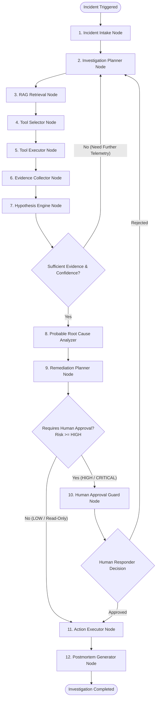
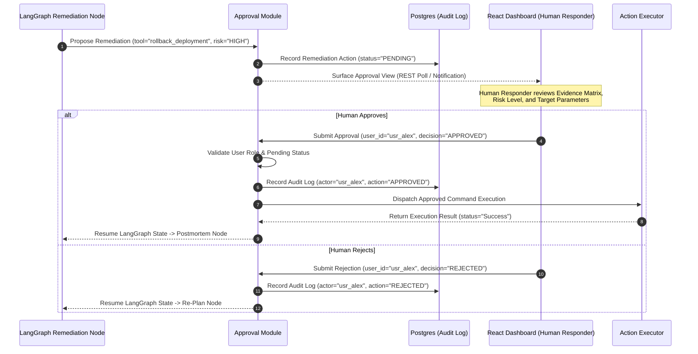

# System Architecture Specification — AI Incident Commander

**Document Version**: 1.1.0 (Correction Pass)  
**Status**: Approved Specification  
**Architecture Type**: Modular Monolith  
**Author**: Lead Software Architect & Senior AI Engineer  

---

## 1. Architecture Overview

**AI Incident Commander** is designed as a **Modular Monolith** optimized for developer ergonomics, local execution via Docker Compose, and progressive learning. The system avoids microservice complexity while maintaining strict internal module boundaries, clear domain layers, and clean component isolation.

The system centers around a state-machine orchestrator powered by **LangGraph**, which coordinates Retrieval-Augmented Generation (**RAG**), simulated engineering tool calls, evidence correlation, hypothesis verification, and human-in-the-loop remediation guardrails.

```mermaid
graph TB
    subgraph Client Layer
        UI[React 18 + TypeScript + Tailwind UI]
    end

    subgraph API Gateway Layer
        FastAPI[FastAPI Web Server / Async REST API]
        Auth[JWT / RBAC Middleware]
    end

    subgraph Core Domain Modules
        Incidents[Incident Management Module]
        RAGModule[RAG & Knowledge Module]
        AgentModule[LangGraph Agent Orchestrator]
        ToolModule[Engineering Tool Adapter Module]
        ApprovalModule[Human Approval Module]
        AuditModule[Audit Log Module]
    end

    subgraph Data & Storage Layer
        Postgres[(PostgreSQL 16\nIncidents, Evidence, Audits)]
        PGVector[(pgvector Extension\nDocument Chunks & Embeddings)]
        RedisCache[(Redis\nState Checkpoints & Caching)]
    end

    subgraph Simulated Tool Adapters (V1)
        ObsSys[Observability Adapter\nSimulated Metrics & Logs]
        GitSys[Git Adapter\nSimulated Commits & Diffs]
        DeploySys[Deployment Adapter\nSimulated Releases & History]
        InfraSys[Infrastructure Adapter\nSimulated Health & Dependencies]
    end

    UI <--> FastAPI
    FastAPI --> Auth
    Auth --> Incidents
    Auth --> AgentModule
    Auth --> RAGModule
    Auth --> ApprovalModule

    AgentModule <--> RAGModule
    AgentModule <--> ToolModule
    AgentModule <--> ApprovalModule
    AgentModule <--> RedisCache

    RAGModule <--> PGVector
    Incidents <--> Postgres
    ApprovalModule <--> Postgres
    AuditModule <--> Postgres

    ToolModule <--> ObsSys
    ToolModule <--> GitSys
    ToolModule <--> DeploySys
    ToolModule <--> InfraSys
```

---

## 2. Major Components

### 2.1 API Gateway (FastAPI)
* **Responsibility**: Provides RESTful HTTP endpoints for incident creation, agent workflow execution, knowledge base management, human approval handling, and audit logging.
* **Key Features**: AsyncIO architecture, Pydantic v2 data validation, JWT authentication, and OpenAPI documentation.

### 2.2 Agent Orchestrator (LangGraph)
* **Responsibility**: Manages stateful, multi-step investigation workflows using a graph-based state machine (`InvestigationState`).
* **Key Features**: Explicit node state persistence, state checkpointing in Redis/PostgreSQL, iterative diagnostic looping, and conditional approval routing.

### 2.3 RAG Knowledge Engine
* **Responsibility**: Ingests, chunks, embeds, and retrieves technical documentation (runbooks, architecture docs, past postmortems, policies).
* **Key Features**:
  * **V1**: Markdown chunking, OpenAI embeddings, and `pgvector` cosine similarity search.
  * **V2 (Enhancement)**: Hybrid retrieval combining PostgreSQL full-text search (`tsvector`) with dense vector similarity.
  * **V3 (Enhancement)**: Reranking and adaptive context selection.

### 2.4 Engineering Tool Adapters (Simulated V1)
* **Responsibility**: Provides a standardized tool calling interface for system queries.
* **Key Features**: Abstract `BaseToolAdapter` base class, Pydantic input validation, latency tracking, and simulated mock providers for reproducible local testing.

### 2.5 Approval & Governance Engine (Human-in-the-Loop)
* **Responsibility**: Intercepts remediation proposals, classifies risk levels (`LOW`, `MEDIUM`, `HIGH`, `CRITICAL`), and blocks execution until an authenticated human responder approves.
* **Key Features**: User role verification (`Responder` / `IncidentCommander`), pending status validation, parameter immutability checks, and approval recording.

### 2.6 Application Audit Log Module
* **Responsibility**: Records all agent diagnostic steps, tool executions, arguments, evidence snippets, human approval decisions, and action outputs.
* **Key Features**: Append-only database logging in PostgreSQL using structured `JSONB` fields.

---

## 3. Agent Architecture & LangGraph State Machine

The AI Incident Commander agent is built as a stateful graph where each node processes the `InvestigationState` object, performs focused logic or tool calls, and returns updated state fields.



### 3.1 LangGraph State Schema (`InvestigationState`)

```python
class InvestigationState(TypedDict):
    incident_id: str
    investigation_id: str
    service_name: str
    severity: str  # SEV-1, SEV-2, SEV-3, SEV-4
    status: str    # Active, Awaiting_Approval, Completed, Failed
    
    # Investigation Plan
    plan_steps: List[Dict[str, Any]]
    current_step_index: int
    
    # Knowledge & Telemetry Context
    retrieved_documents: List[Dict[str, Any]]
    tool_call_history: List[Dict[str, Any]]
    
    # Evidence & Hypotheses Matrix
    collected_evidence: List[Dict[str, Any]]
    hypotheses: List[Dict[str, Any]]
    probable_root_cause: Optional[Dict[str, Any]]
    
    # Remediation & HITL State
    remediation_proposal: Optional[Dict[str, Any]]
    approval_status: str  # PENDING, APPROVED, REJECTED, EXPIRED
    execution_result: Optional[Dict[str, Any]]
    
    # Control Flags
    error_logs: List[str]
    is_completed: bool
```

---

## 4. Human Approval Flow (HITL Guardrails)

The architecture enforces a strict separation between **AI Recommendation**, **Human Approval**, and **Action Execution**.



---

## 5. Security & Input Verification

1. **Tool Permission Boundaries**: Read-only diagnostic tool adapters run automatically during telemetry collection. State-modifying remediation adapters strictly require approval validation before execution.
2. **Input Schema Validation**: Tool parameters generated by the LLM are parsed and validated via Pydantic schemas before invocation.
3. **Secret Masking**: Telemetry outputs (log lines, git diffs) are passed through regex scrubber filters to mask access keys or passwords before injecting snippets into LLM context.

---

## 6. Failure Handling Strategies

* **LLM Tool Call Parsing Failures**: If an LLM returns malformed tool arguments, the Executor node catches the validation error, appends an error message into state, and routes back to the selector for retry.
* **Tool Adapter Exceptions**: Simulated adapters handle internal exceptions gracefully, returning a structured error response (`"status": "Error"`, `"message": "..."`) allowing the agent to attempt alternative diagnostic paths.
* **State Persistence**: LangGraph state checkpoints in Redis/PostgreSQL ensure investigations can recover seamlessly following worker restarts.
