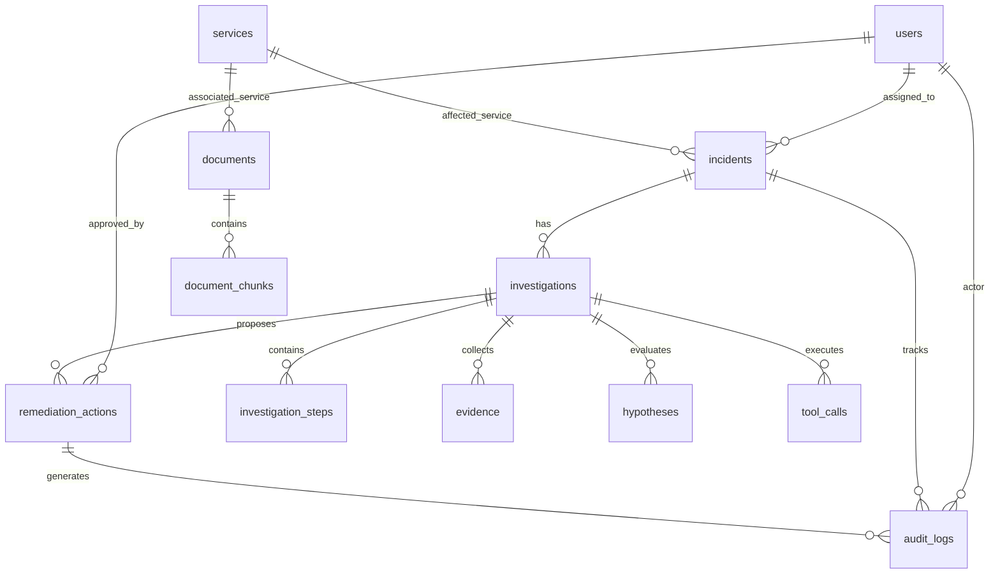

# Database Design & Schema Specification — AI Incident Commander

**Document Version**: 1.1.0 (Correction Pass)  
**Status**: Approved Specification  
**Database Engine**: PostgreSQL 16+ with `pgvector` extension  
**Author**: Lead Software Architect & Senior AI Engineer  

---

## 1. Database Goals

The database for **AI Incident Commander** is designed to provide:

1. **Investigation Traceability**: Store the full lineage of an incident investigation—from alert ingest to plan steps, tool calls, evidence items, hypotheses, remediation proposals, human sign-offs, and final postmortems.
2. **Knowledge Vector Storage**: Store document metadata, full text, text chunks, and 1536-dimensional embeddings (`pgvector`) alongside relational data.
3. **Structured & Semi-Structured Storage**: Utilize `JSONB` for dynamic tool arguments, raw telemetry payloads, and evidence metadata without sacrificing relational constraints.
4. **Append-Only Application Audit Log**: Record append-only audit entries for all high-risk remediation actions, tool executions, and human approval decisions.

---

## 2. ER Diagram

---

## 3. Table Definitions & Standardized Statuses

---

### 3.1 `users`
**Purpose**: Stores user accounts, roles, credentials, and authentication metadata.

| Column | Data Type | Constraints | Default | Description |
| :--- | :--- | :--- | :--- | :--- |
| `id` | `UUID` | `PRIMARY KEY` | `gen_random_uuid()` | User identifier |
| `email` | `VARCHAR(255)` | `UNIQUE, NOT NULL` | None | User email address |
| `full_name` | `VARCHAR(255)` | `NOT NULL` | None | Full name |
| `hashed_password` | `VARCHAR(255)` | `NOT NULL` | None | Password hash |
| `role` | `VARCHAR(50)` | `NOT NULL` | `'Responder'` | Role (`Admin`, `IncidentCommander`, `Responder`, `Viewer`) |
| `is_active` | `BOOLEAN` | `NOT NULL` | `TRUE` | Active flag |
| `created_at` | `TIMESTAMPTZ` | `NOT NULL` | `NOW()` | Creation timestamp |
| `updated_at` | `TIMESTAMPTZ` | `NOT NULL` | `NOW()` | Last update timestamp |

---

### 3.2 `services`
**Purpose**: Service catalog detailing microservices, databases, and dependencies.

| Column | Data Type | Constraints | Default | Description |
| :--- | :--- | :--- | :--- | :--- |
| `id` | `UUID` | `PRIMARY KEY` | `gen_random_uuid()` | Service ID |
| `name` | `VARCHAR(100)` | `UNIQUE, NOT NULL` | None | Service name (e.g., `payment-service`) |
| `description` | `TEXT` | `NULLABLE` | None | Service summary |
| `owner_team` | `VARCHAR(100)` | `NOT NULL` | None | Owner team name |
| `tier` | `VARCHAR(20)` | `NOT NULL` | `'Tier-2'` | Service tier (`Tier-0`, `Tier-1`, `Tier-2`) |
| `repository_url` | `VARCHAR(255)` | `NULLABLE` | None | Git URL |
| `dependencies` | `JSONB` | `NOT NULL` | `'[]'::jsonb` | Array of upstream service names |
| `created_at` | `TIMESTAMPTZ` | `NOT NULL` | `NOW()` | Creation timestamp |
| `updated_at` | `TIMESTAMPTZ` | `NOT NULL` | `NOW()` | Last update timestamp |

---

### 3.3 `incidents`
**Purpose**: Primary entity recording ingested production alerts and incidents.

| Column | Data Type | Constraints | Default | Description |
| :--- | :--- | :--- | :--- | :--- |
| `id` | `UUID` | `PRIMARY KEY` | `gen_random_uuid()` | Incident ID |
| `title` | `VARCHAR(255)` | `NOT NULL` | None | Incident title |
| `description` | `TEXT` | `NOT NULL` | None | Alert description payload |
| `severity` | `VARCHAR(20)` | `NOT NULL` | `'SEV-2'` | Severity (`SEV-1`, `SEV-2`, `SEV-3`, `SEV-4`) |
| `status` | `VARCHAR(30)` | `NOT NULL` | `'Triggered'` | Status (`Triggered`, `Investigating`, `Mitigated`, `Resolved`) |
| `service_id` | `UUID` | `FK -> services.id` | `NOT NULL` | Affected service ID |
| `assigned_to` | `UUID` | `FK -> users.id` | `NULLABLE` | Assigned responder |
| `created_at` | `TIMESTAMPTZ` | `NOT NULL` | `NOW()` | Ingest timestamp |
| `resolved_at` | `TIMESTAMPTZ` | `NULLABLE` | None | Resolution timestamp |

---

### 3.4 `investigations`
**Purpose**: Represents an active or historical agent investigation session.

| Column | Data Type | Constraints | Default | Description |
| :--- | :--- | :--- | :--- | :--- |
| `id` | `UUID` | `PRIMARY KEY` | `gen_random_uuid()` | Investigation ID |
| `incident_id` | `UUID` | `FK -> incidents.id` | `NOT NULL` | Parent incident ID |
| `investigation_number`| `VARCHAR(50)` | `UNIQUE, NOT NULL` | None | Readable ID (e.g., `INV-1042`) |
| `status` | `VARCHAR(30)` | `NOT NULL` | `'Active'` | Status (`Active`, `Awaiting_Approval`, `Completed`, `Failed`) |
| `probable_root_cause` | `TEXT` | `NULLABLE` | None | Probable root cause summary |
| `confidence_score` | `FLOAT` | `NULLABLE` | None | Confidence rating (0.00 to 1.00) |
| `created_at` | `TIMESTAMPTZ` | `NOT NULL` | `NOW()` | Start timestamp |
| `completed_at` | `TIMESTAMPTZ` | `NULLABLE` | None | Completion timestamp |

---

### 3.5 `investigation_steps`
**Purpose**: Diagnostic steps planned and executed by the LangGraph agent.

| Column | Data Type | Constraints | Default | Description |
| :--- | :--- | :--- | :--- | :--- |
| `id` | `UUID` | `PRIMARY KEY` | `gen_random_uuid()` | Step ID |
| `investigation_id` | `UUID` | `FK -> investigations.id`| `NOT NULL` | Parent investigation ID |
| `step_order` | `INT` | `NOT NULL` | None | Execution sequence index |
| `title` | `VARCHAR(255)` | `NOT NULL` | None | Step title |
| `status` | `VARCHAR(30)` | `NOT NULL` | `'Pending'` | Status (`Pending`, `In_Progress`, `Completed`, `Failed`) |
| `output_summary` | `TEXT` | `NULLABLE` | None | Result summary |
| `created_at` | `TIMESTAMPTZ` | `NOT NULL` | `NOW()` | Creation timestamp |

---

### 3.6 `evidence`
**Purpose**: Empirical telemetry findings collected during investigation steps.

| Column | Data Type | Constraints | Default | Description |
| :--- | :--- | :--- | :--- | :--- |
| `id` | `UUID` | `PRIMARY KEY` | `gen_random_uuid()` | Evidence ID |
| `investigation_id` | `UUID` | `FK -> investigations.id`| `NOT NULL` | Parent investigation ID |
| `source_tool` | `VARCHAR(100)` | `NOT NULL` | None | Source tool name (e.g., `search_logs`) |
| `summary` | `TEXT` | `NOT NULL` | None | Evidence summary |
| `raw_payload` | `JSONB` | `NOT NULL` | None | Raw tool output payload |
| `relevance_score` | `FLOAT` | `NOT NULL` | `0.5` | Relevance weight (0.0 to 1.0) |
| `collected_at` | `TIMESTAMPTZ` | `NOT NULL` | `NOW()` | Collection timestamp |

---

### 3.7 `hypotheses`
**Purpose**: Competing diagnostic hypotheses evaluated during investigation.

| Column | Data Type | Constraints | Default | Description |
| :--- | :--- | :--- | :--- | :--- |
| `id` | `UUID` | `PRIMARY KEY` | `gen_random_uuid()` | Hypothesis ID |
| `investigation_id` | `UUID` | `FK -> investigations.id`| `NOT NULL` | Parent investigation ID |
| `hypothesis_text` | `TEXT` | `NOT NULL` | None | Hypothesis statement |
| `status` | `VARCHAR(30)` | `NOT NULL` | `'Proposed'` | Status (`Proposed`, `Verified_Strong`, `Verified_Weak`, `Ruled_Out`) |
| `supporting_evidence_ids`| `UUID[]` | `NOT NULL` | `'{}'` | Supporting evidence UUID array |
| `opposing_evidence_ids` | `UUID[]` | `NOT NULL` | `'{}'` | Opposing evidence UUID array |
| `confidence_score` | `FLOAT` | `NOT NULL` | `0.0` | Confidence rating (0.0 to 1.0) |
| `created_at` | `TIMESTAMPTZ` | `NOT NULL` | `NOW()` | Creation timestamp |

---

### 3.8 `tool_calls`
**Purpose**: Record of diagnostic and remediation tool calls.

| Column | Data Type | Constraints | Default | Description |
| :--- | :--- | :--- | :--- | :--- |
| `id` | `UUID` | `PRIMARY KEY` | `gen_random_uuid()` | Tool call record ID |
| `investigation_id` | `UUID` | `FK -> investigations.id`| `NOT NULL` | Parent investigation ID |
| `tool_name` | `VARCHAR(100)` | `NOT NULL` | None | Tool name |
| `arguments` | `JSONB` | `NOT NULL` | None | Tool arguments |
| `result` | `JSONB` | `NULLABLE` | None | Tool response payload |
| `status` | `VARCHAR(30)` | `NOT NULL` | `'Success'` | Status (`Success`, `Error`, `Timeout`) |
| `execution_time_ms` | `INT` | `NOT NULL` | None | Execution latency (ms) |
| `created_at` | `TIMESTAMPTZ` | `NOT NULL` | `NOW()` | Start timestamp |

---

### 3.9 `remediation_actions`
**Purpose**: Proposed, approved, rejected, or executed remediation actions.

| Column | Data Type | Constraints | Default | Description |
| :--- | :--- | :--- | :--- | :--- |
| `id` | `UUID` | `PRIMARY KEY` | `gen_random_uuid()` | Action ID |
| `investigation_id` | `UUID` | `FK -> investigations.id`| `NOT NULL` | Parent investigation ID |
| `action_name` | `VARCHAR(100)` | `NOT NULL` | None | Action tool name (e.g., `rollback_deployment`) |
| `parameters` | `JSONB` | `NOT NULL` | None | Action parameters |
| `reasoning` | `TEXT` | `NOT NULL` | None | Justification text |
| `risk_level` | `VARCHAR(20)` | `NOT NULL` | `'HIGH'` | Risk level (`LOW`, `MEDIUM`, `HIGH`, `CRITICAL`) |
| `approval_status` | `VARCHAR(30)` | `NOT NULL` | `'PENDING'` | Status (`PENDING`, `APPROVED`, `REJECTED`, `EXPIRED`) |
| `approved_by` | `UUID` | `FK -> users.id` | `NULLABLE` | Approving user ID |
| `approval_timestamp` | `TIMESTAMPTZ` | `NULLABLE` | None | Approval timestamp |
| `execution_result` | `JSONB` | `NULLABLE` | None | Execution output payload |
| `created_at` | `TIMESTAMPTZ` | `NOT NULL` | `NOW()` | Proposal timestamp |

---

### 3.10 `documents`
**Purpose**: Knowledge base files ingested for RAG.

| Column | Data Type | Constraints | Default | Description |
| :--- | :--- | :--- | :--- | :--- |
| `id` | `UUID` | `PRIMARY KEY` | `gen_random_uuid()` | Document ID |
| `title` | `VARCHAR(255)` | `NOT NULL` | None | Document title |
| `category` | `VARCHAR(50)` | `NOT NULL` | None | Category (`runbook`, `architecture`, `incident`, `policy`) |
| `file_path` | `VARCHAR(255)` | `NOT NULL` | None | File path |
| `associated_service_id`| `UUID` | `FK -> services.id` | `NULLABLE` | Service ID |
| `content_hash` | `VARCHAR(64)` | `NOT NULL` | None | SHA-256 deduplication hash |
| `created_at` | `TIMESTAMPTZ` | `NOT NULL` | `NOW()` | Ingest timestamp |

---

### 3.11 `document_chunks`
**Purpose**: Document text chunks with dense vector embeddings for RAG retrieval.

| Column | Data Type | Constraints | Default | Description |
| :--- | :--- | :--- | :--- | :--- |
| `id` | `UUID` | `PRIMARY KEY` | `gen_random_uuid()` | Chunk ID |
| `document_id` | `UUID` | `FK -> documents.id` | `NOT NULL` | Parent document ID |
| `chunk_index` | `INT` | `NOT NULL` | None | Sequence position |
| `content` | `TEXT` | `NOT NULL` | None | Text content |
| `metadata` | `JSONB` | `NOT NULL` | `'{}'::jsonb` | Section metadata |
| `embedding` | `vector(1536)` | `NOT NULL` | None | OpenAI 1536-dim embedding |
| `ts_vector` | `tsvector` | `NULLABLE` | None | Full-text vector (for V2 sparse search) |

**Indexes**:
* `idx_chunks_document_id` (B-tree on `document_id`)
* `idx_chunks_embedding_hnsw` (HNSW index on `embedding` using `vector_cosine_ops`)
* `idx_chunks_ts_vector` (GIN index on `ts_vector` for V2 hybrid search)

---

### 3.12 `audit_logs`
**Purpose**: Append-only application audit log for security and investigation history.

| Column | Data Type | Constraints | Default | Description |
| :--- | :--- | :--- | :--- | :--- |
| `id` | `UUID` | `PRIMARY KEY` | `gen_random_uuid()` | Audit ID |
| `incident_id` | `UUID` | `FK -> incidents.id` | `NULLABLE` | Associated incident ID |
| `actor_id` | `UUID` | `FK -> users.id` | `NULLABLE` | Actor user ID (NULL for system) |
| `actor_type` | `VARCHAR(50)` | `NOT NULL` | None | Actor type (`SYSTEM_AGENT`, `HUMAN_USER`) |
| `action_type` | `VARCHAR(100)` | `NOT NULL` | None | Action label |
| `payload` | `JSONB` | `NOT NULL` | None | Action detail payload |
| `created_at` | `TIMESTAMPTZ` | `NOT NULL` | `NOW()` | Event timestamp |
