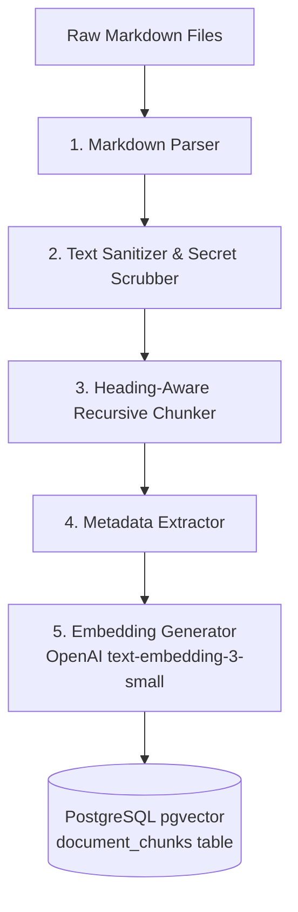
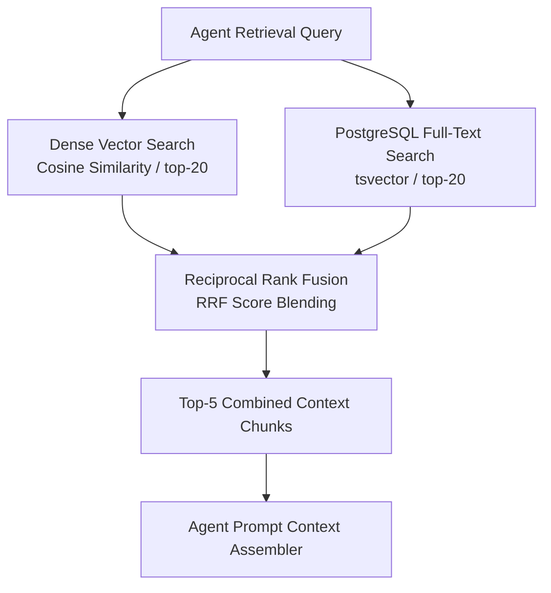

# RAG Design Specification — AI Incident Commander

**Document Version**: 1.1.0 (Correction Pass)  
**Status**: Approved Specification  
**Vector Engine**: PostgreSQL 16 + `pgvector` extension  
**Author**: Lead Software Architect & Senior AI Engineer  

---

## 1. RAG Goals & Progressive Architecture

The Retrieval-Augmented Generation (RAG) engine provides **AI Incident Commander** with technical organizational context during software incident investigations.

The RAG engine is structured progressively across project phases:

### V1 RAG (MVP Core)
```text
Documents ──► Cleaning ──► Heading-Aware Chunking ──► OpenAI Embeddings ──► pgvector Cosine Search ──► Top-K Context
```

### V2 RAG (Hybrid Enhancement)
```text
Dense Vector Similarity Search + PostgreSQL Sparse Full-Text Search (tsvector) ──► Reciprocal Rank Fusion (RRF)
```

### V3 RAG (Advanced Reranking)
```text
Hybrid Candidates ──► Cross-Encoder Reranker ──► Adaptive Threshold Context Window
```

---

## 2. Knowledge Sources & Structure

Synthetic, realistic engineering documentation will be indexed under `knowledge_base/`:

```
knowledge_base/
├── runbooks/                   # Service-specific troubleshooting guides
│   ├── payment-service.md
│   ├── auth-service.md
│   └── database-cluster.md
├── architecture/               # System architecture specs & dependency maps
│   ├── overview.md
│   └── data-flow.md
├── incidents/                  # Historic postmortem reports
│   ├── INC-2025-08-01-payment-timeout.md
│   └── INC-2025-09-12-auth-rate-limit.md
└── policies/                   # Severity guidelines & escalation policies
    ├── severity-policy.md
    └── deployment-policy.md
```

---

## 3. Document Ingestion Pipeline



### 3.1 Cleaning & Normalization
* Strip redundant whitespaces and formatting artifacts.
* Scrub embedded secrets or access tokens via regex filters.
* Generate a SHA-256 `content_hash` for each document to prevent duplicate indexing.

### 3.2 Chunking Strategy (Heading-Aware Markdown Chunking)
* **Target Chunk Size**: ~500 tokens (~2,000 characters).
* **Chunk Overlap**: 50 tokens (~200 characters).
* **Boundary Rules**: Prefer splitting on Markdown Headers (`#`, `##`, `###`), code blocks (````` `` ` ``` ``), and paragraph breaks (`\n\n`).
* **Header Injection**: Prepend section breadcrumbs to each chunk (e.g., `[Document: runbooks/payment-service.md -> Section: ## Timeout Recovery]`).

### 3.3 Metadata Schema
```json
{
  "document_id": "doc_9912-42a1",
  "category": "runbook",
  "service_name": "payment-service",
  "section_title": "Timeout Recovery Procedures",
  "token_count": 480,
  "file_path": "knowledge_base/runbooks/payment-service.md"
}
```

---

## 4. Vector Storage Schema (PostgreSQL + `pgvector`)

The platform uses **PostgreSQL 16** with `pgvector`, keeping vector storage unified with relational data.

### 4.1 Schema Definition (`document_chunks`)
```sql
CREATE TABLE document_chunks (
    id UUID PRIMARY KEY DEFAULT gen_random_uuid(),
    document_id UUID NOT NULL REFERENCES documents(id) ON DELETE CASCADE,
    chunk_index INT NOT NULL,
    content TEXT NOT NULL,
    metadata JSONB NOT NULL DEFAULT '{}'::jsonb,
    embedding vector(1536) NOT NULL,
    ts_vector tsvector GENERATED ALWAYS AS (to_tsvector('english', content)) STORED
);
```

### 4.2 Indexing Strategy
1. **Dense Vector Similarity Index (V1)**: Hierarchical Navigable Small World (**HNSW**) index using Cosine Distance (`vector_cosine_ops`).
   ```sql
   CREATE INDEX idx_chunks_embedding_hnsw 
   ON document_chunks 
   USING hnsw (embedding vector_cosine_ops)
   WITH (m = 16, ef_construction = 64);
   ```
2. **Sparse Full-Text Index (V2 Enhancement)**: Generalized Inverted Index (**GIN**) on `tsvector` for keyword matching (service names, error codes).
   ```sql
   CREATE INDEX idx_chunks_ts_vector 
   ON document_chunks 
   USING gin (ts_vector);
   ```

---

## 5. V2 Hybrid Retrieval & Fusion (Enhancement Path)

In V2, retrieval combines dense vector similarity with PostgreSQL sparse full-text keyword retrieval (`tsvector`).



---

## 6. Context Construction & Source Citations

Retrieved chunks are passed into the agent's context window formatted with explicit source attributions:

```markdown
### RETRIEVED ORGANIZATIONAL KNOWLEDGE

[Source: runbooks/payment-service.md | Section: Timeout Recovery]
> If payment gateway error rate exceeds 15% following a deployment, verify the timeout setting in payment-service config. Default timeout must be >= 5000ms. If set below 1000ms, gateway drops connections under load.

[Source: incidents/INC-2025-08-01-payment-timeout.md | Section: Postmortem]
> Postmortem: Deployment v2.1.0 reduced RPC timeout to 500ms, causing cascading gateway failures. Mitigated by rolling back to v2.0.9.
```

### Citation Rules
1. The agent **must explicitly cite** source paths (e.g., `[runbooks/payment-service.md]`) when incorporating facts from retrieved documents into step outputs or hypothesis summaries.
2. If retrieved context is insufficient or uninformative, the agent **does not force a RAG response**. It sets a `NO_RELEVANT_KNOWLEDGE_FOUND` status and relies on diagnostic tool execution.

---

## 7. Retrieval Evaluation Metrics

Rather than promising fixed baseline scores, RAG performance will be systematically measured during **Phase 7** evaluation using five key metrics:

| Metric | Measurement Purpose |
| :--- | :--- |
| **Recall@K** | Measures whether ground-truth runbook chunks are present in the top-K retrieved results |
| **Mean Reciprocal Rank (MRR)** | Measures ranking quality and position of the first relevant document chunk |
| **Context Relevance** | Measures the proportion of retrieved chunk tokens directly relevant to the incident |
| **Faithfulness** | Measures the degree to which generated claims are grounded *only* in retrieved context |
| **Answer Relevance** | Measures how directly the response addresses the diagnostic investigation step |
